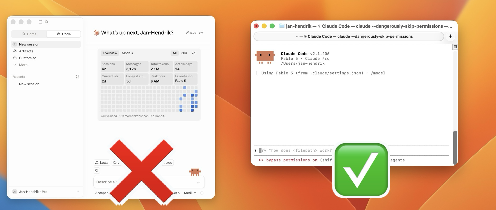

# nodebpy-agent-skills

Claude Code skills for building Blender node trees (geometry, shader, compositor)
with [nodebpy](https://bradyajohnston.github.io/nodebpy/), executed live in Blender
via the [Blender MCP](https://github.com/ahujasid/blender-mcp).

## Install

Inside Claude Code (only works in the CLI version, not in the destop app):



```
/plugin marketplace add kolibril13/nodebpy-agent-skills
/plugin install nodebpy@nodebpy-agent-skills
```

For local development (picks up your edits from this checkout, chance /Users/jan-hendrik to your path ):

```
/plugin marketplace add /Users/jan-hendrik/projects/nodebpy-agent-skills
/plugin install nodebpy@nodebpy-agent-skills
```

## Structure

```
.claude-plugin/
  marketplace.json   # marketplace listing (this repo is its own marketplace)
  plugin.json        # plugin metadata
skills/
  nodebpy/
    SKILL.md         # main skill; add references/ files next to it as content grows
```

Skills in `skills/` are auto-discovered — add a new folder with a `SKILL.md` to add
a skill, no registration needed.
